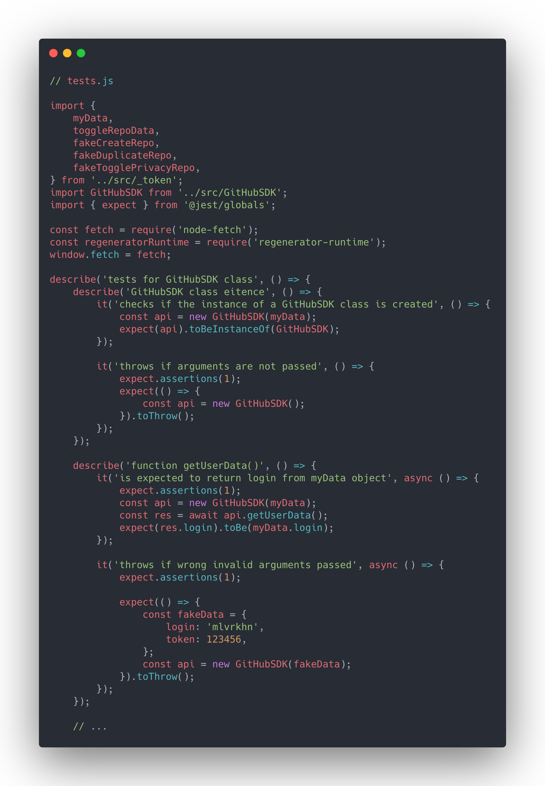
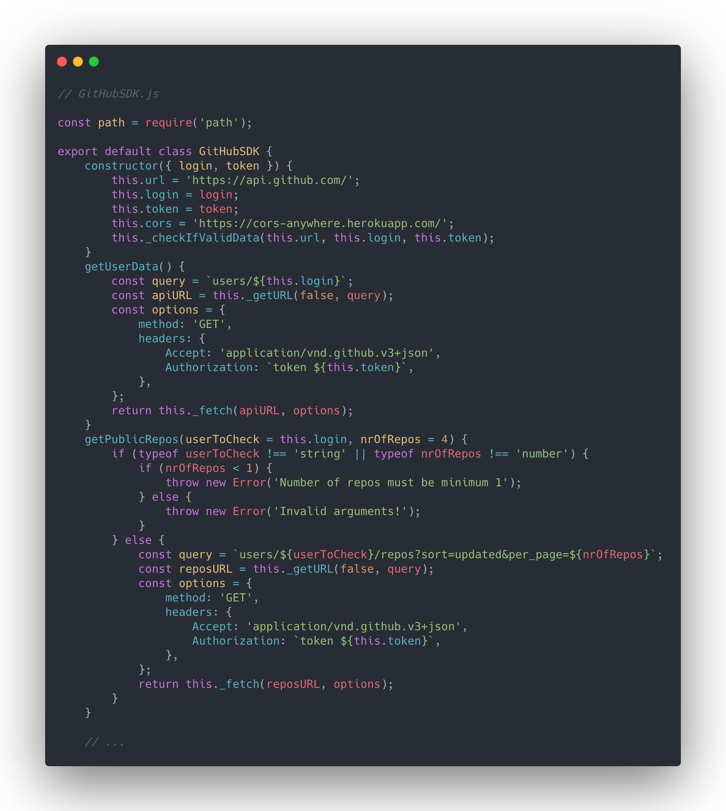

# Software Development Kit for Github with Unit Testing

## Project description

Create Software Development Kit that will allow you to automate workflow by allowing to remotely manage your GitHub account settings, repositories and other available actions defined in GitHub REST API.  

Scroll down to see the code samples.

## Project Difficilties
- Create a JavaScript Class with SDK above functionality, 
- use Personal Token and Authorization to fetch and handle data from GitHub REST API,
- usage of Red-Green-Refactor technique to create tests before coding the project,
- create, send and handle asynchronous fetch requests and errors,
- SDK updates recent list of your repositories completely auomatically

## My Solution

After providing your username and token you are able to effortlessly:

- create new repositories and delete old ones,
- toggle repositories privacy settings,
- get public repositories based on given username,
- validate provided data,
- securely communicate with external API via JSON-files

## Notable features

- entire project covered with Unit Tests made in accordance with the Test Driven Development (TDD) methodology,
- secure and authenticated connection to API using personal-access-token,
- build a class GitHubSDK.js connected to API via fetch function and async code

## Code samples  
 

##### Build with help of Mateusz Bogolubow, [Devmentor](www.devmentor.pl).